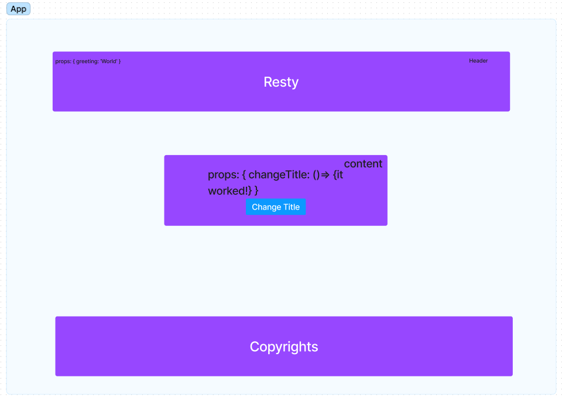

# Restful API Front End

## Project: Resty

### Author: Zoe Gonzalez

# Problem Domain

## Creating an app in the front end called resty. This is a project that will allow users to interact with API using a familiar and simple UI

## GitHub Actions: <https://github.com/ZuSolaris/basic-express-server/actions/new>

## Production Deployment: Deployment currently in progress still talking to ryan about it

## Setup

npm i to install dependencies

## How to initalize application and testing

'npm run build'

'npm start'

'npm test'

Features

/GET: Will retrieve data from a built in API.

;
